# Codebase Flow Diagrams

This document maps the main runtime flows across the React frontend, Spring gateway, FastAPI orchestrator, Kafka workers, storage, and external services.

## System Context

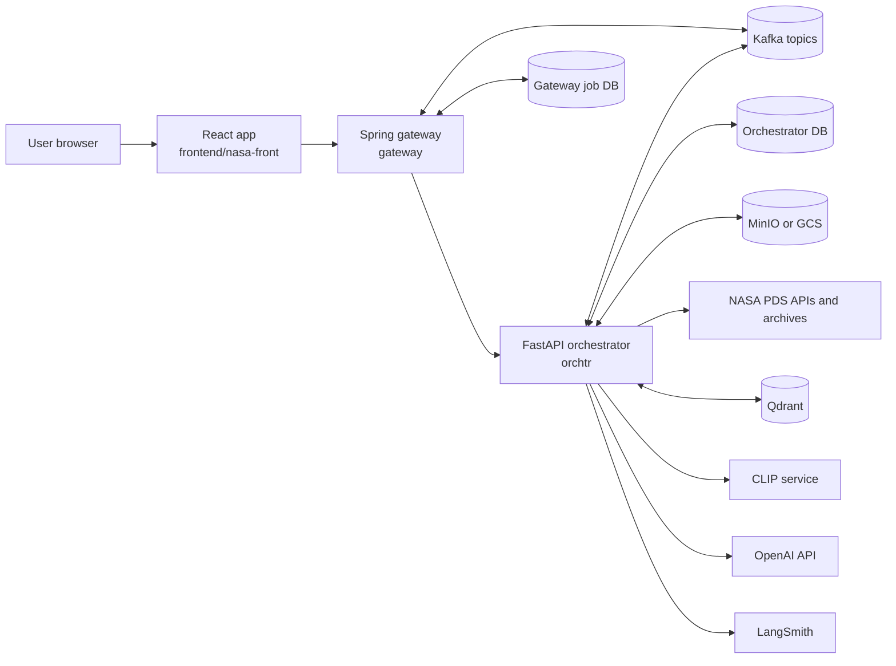

## Frontend Routes And API Boundary

```mermaid
flowchart TD
  App[App.jsx BrowserRouter]
  Nav[UserAppBar + AIControlPanelTabs]
  Auth[KeycloakProvider + apiFetch]

  App --> Missions[/missions]
  App --> Published[/gallery<br/>/published-projects]
  App --> Discover[/discover<br/>/discover/:id]
  App --> Projects[/my-projects<br/>/my-projects/:id]
  App --> Admin[/admin]
  App --> Vector[/vector-search]

  Nav --> App
  Auth --> Projects
  Auth --> Admin
  Auth --> Vector

  Discover -->|/api/discovery| Gateway[Spring gateway]
  Discover -->|/api/qdrant/add| Gateway
  Projects -->|/api/projects<br/>/api/jobs<br/>/api/models| Gateway
  Published -->|/api/projects/published| Gateway
  Admin -->|/api/admin/jobs<br/>/api/langsmith/stats| Gateway
  Vector -->|/api/qdrant/search| Gateway
```

## Authentication And Authorization

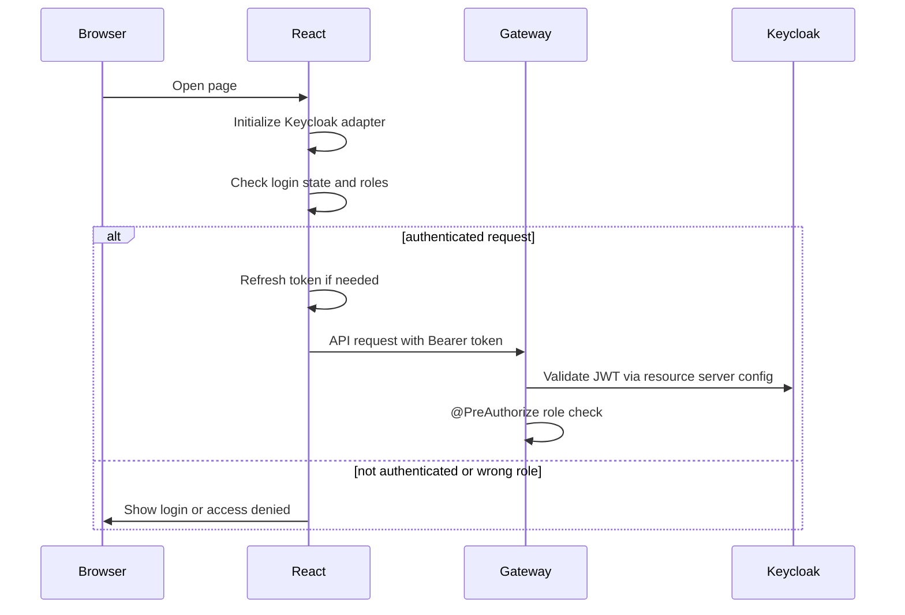

## Gateway Routing

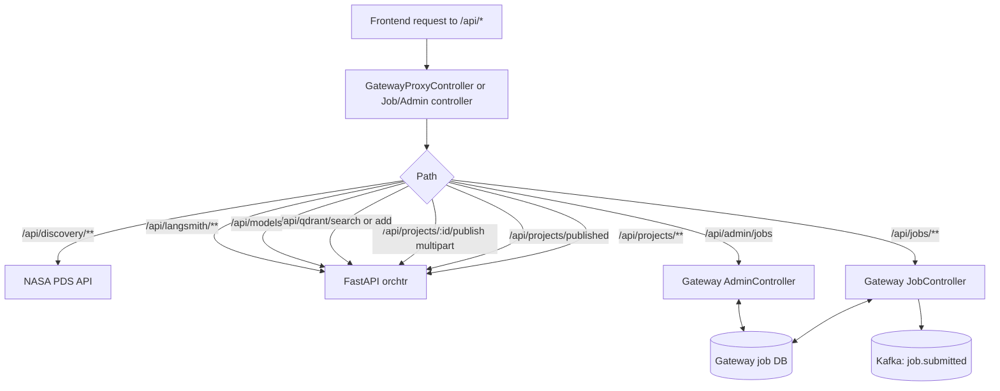

## Discovery And Static Cursor Pagination

```mermaid
flowchart TD
  DiscoverPage[DiscoverPage]
  Hook[usePds4Products]
  StaticIndex[/public/pds4-page-index.json/]
  GatewayDiscovery[/api/discovery/**]
  PDS[PDS search API]

  DiscoverPage --> Hook
  Hook --> StaticIndex
  Hook -->|page 1 or discovered cursor| GatewayDiscovery
  GatewayDiscovery --> PDS
  PDS --> GatewayDiscovery
  GatewayDiscovery --> Hook
  Hook --> DiscoverPage

  Script[scripts/build-pds4-page-index.mjs] -->|sequential cursor walk| GatewayDiscovery
  Script -->|writes page -> search-after table| StaticIndex
```

## Project CRUD And Add Image

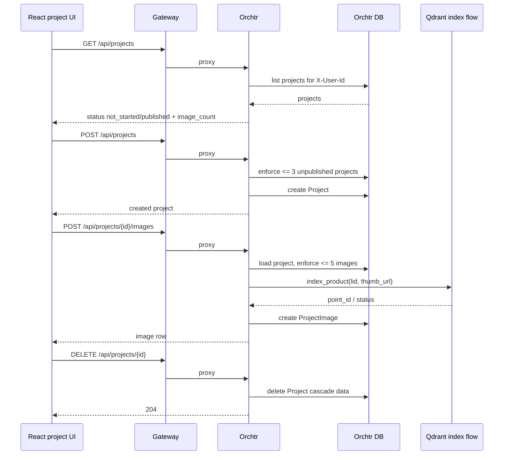

## Vector Indexing Flow

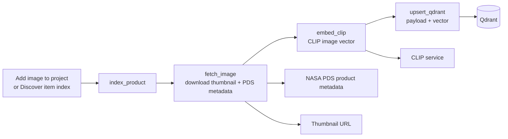

## Vector Search Flow

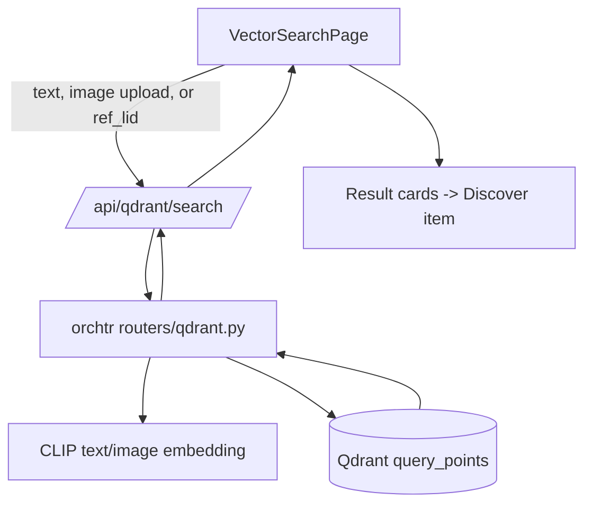

## Async Analysis Job Flow

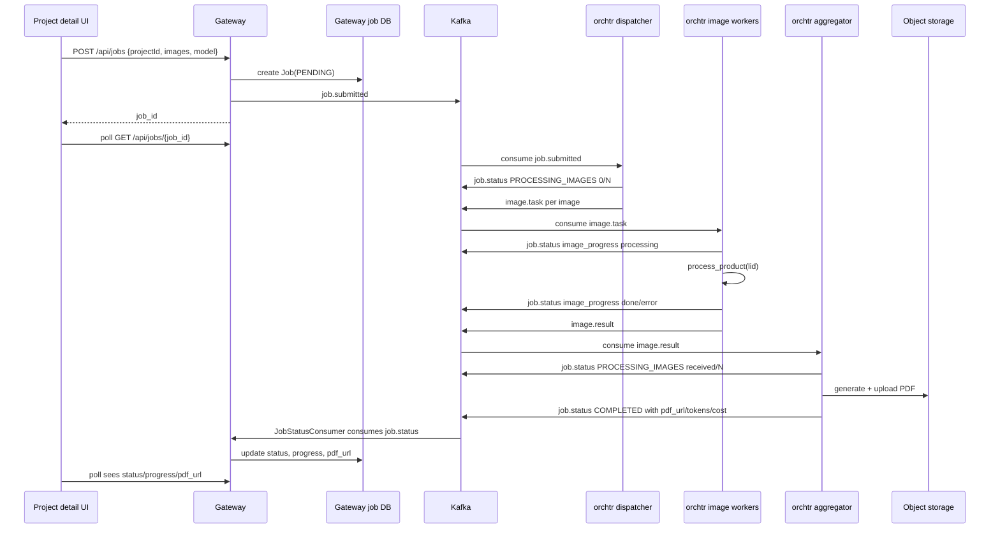

## Single Image Analysis Pipeline

```mermaid
flowchart TD
  Start[process_product(lid, model, job_id)]
  Graph[LangGraph single_graph]
  Ingest[ingest_one]
  Transform[transform_one]
  Analyze[analyze_one]
  Result[analysis result]
  PDS[PDS registry + image archive]
  Storage[(Object storage)]
  OpenAI[OpenAI vision]
  LangSmith[LangSmith trace tag job:id]

  Start --> Graph
  Graph --> Ingest
  Ingest -->|resolve latest LID + metadata| PDS
  Ingest -->|download .IMG| PDS
  Ingest -->|raw .IMG + metadata JSON| Storage
  Ingest --> Transform
  Transform -->|download .IMG| Storage
  Transform -->|decode PDS IMG| Transform
  Transform -->|gray.jpg, rgb.jpg, array_summary.json| Storage
  Transform --> Analyze
  Analyze -->|download best image + metadata + array summary| Storage
  Analyze -->|image + scientific context| OpenAI
  Analyze -->|result.json| Storage
  Analyze --> Result
  Start -. job context .-> LangSmith
```

## Report And Publish Flow

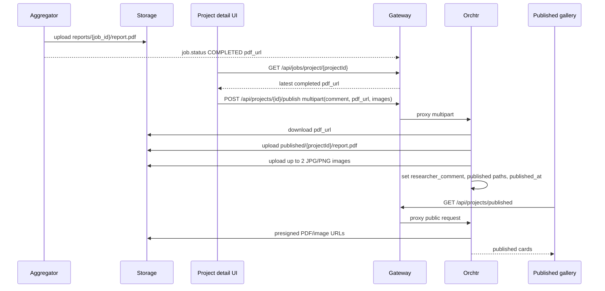

## Chat Flow

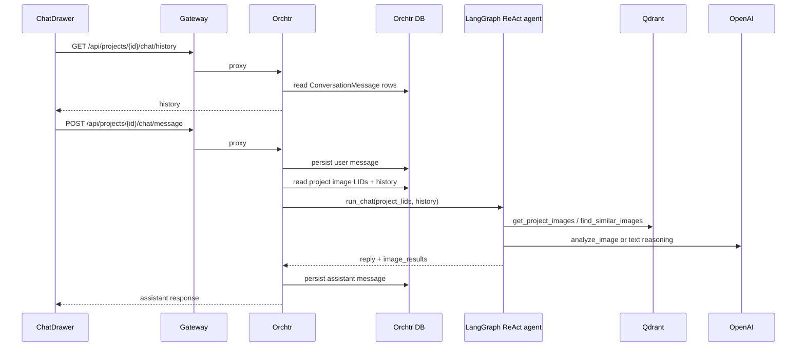

## Admin And Observability Flow

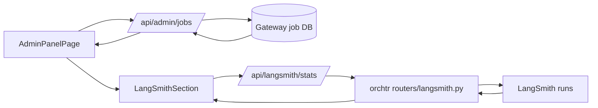

## Storage Layout

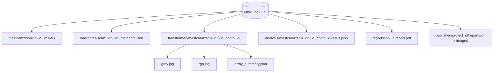
